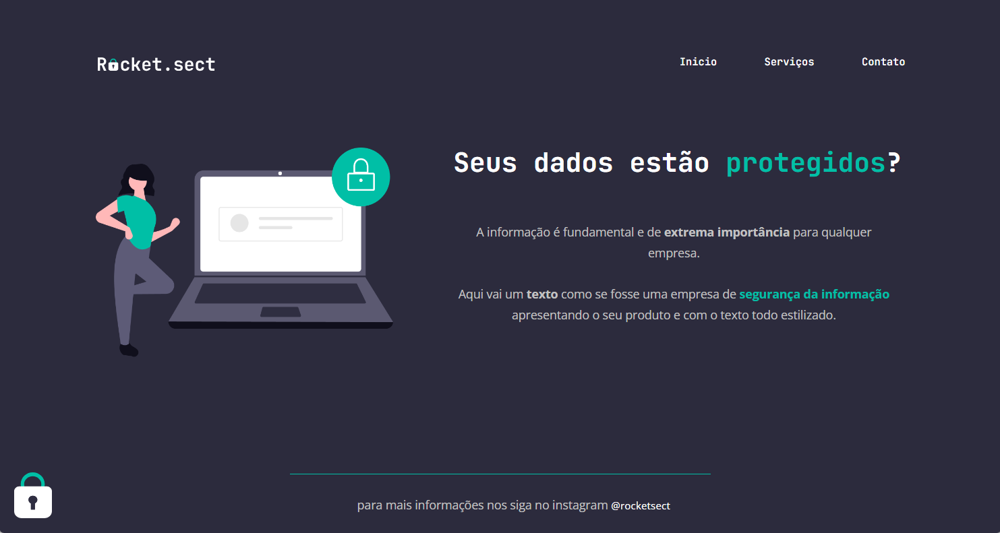

<h1 align="center"> # Explorer - S02 - Rocketsect </h1>

Exercício desafio do stage 02 do curso Explorer da rocketseat

## 🚀 Tecnologias

Esse projeto foi desenvolvido com as seguintes tecnologias:

- HTML e CSS
- Git e Github
- Figma
  

## Conceitos utilizados

Foram utilizados os seguintes conceitos e resources:

- Display flex
    - justify-content
    - align-itens
    - gap
  

## 💻 Preview

  

