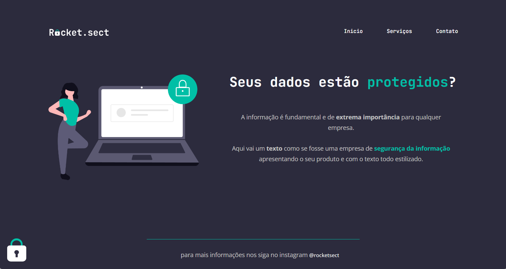

# rocketseat-explorerS02-rocketsect
Página criada como segundo exercício desafio do stage 02 do curso Explorer da rocketseat

  

## 🚀 Tecnologias
Esse projeto foi desenvolvido com as seguintes tecnologias:

- HTML e CSS
- JavaScript
- Git e Github
- Figma

## Conceitos utilizados
- Display flex
    - justify-content
    - align-itens
    - gap
